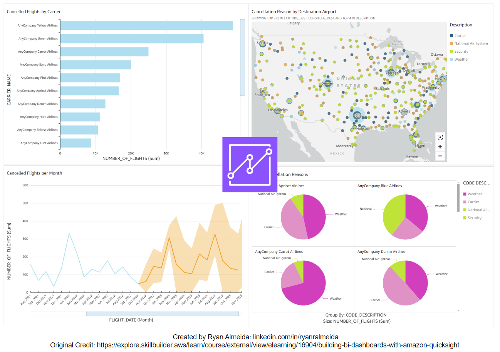

# Build Dashboards with Amazon QuickSight 

## Project Description:
This project allows you to analyze and visualize flight data using Amazon QuickSight, and practice using Business Intelligence (BI) Tools to gain insights about your data. 

The project is an example that was built alongside the tutorials offered from AWS Skill Builders (https://explore.skillbuilder.aws/learn/course/external/view/elearning/16904/building-bi-dashboards-with-amazon-quicksight) that teaches you how to use QuickSight to ingest and prepare data, create visualizations, add filters, create dashboards, and ultimatly gain insights using data. 

QuickSight allows you to appreciate the strength of using a pre-built dashboard tool functionality. In this project you use QuickSight to create: 

1. A bar chart
2. A geospatial chart
3. A Sankey Diagram
4. A pie chart
5. An ML-powered forecast chart

## Example Dashboards:

## Learning Outcomes:
By following this AWS QuickSight project, one can gain valuable skills in several key areas:

- Data Ingestion and Preparation: Learn how to import and prepare data from CSV files (or other file types) - a common requirement in data analysis tasks. This project teaches how to clean, transform, and ready the data for visualization.

- Data Visualization: Gain experience in creating a variety of visualizations, including bar charts, geospatial charts, Sankey diagrams, pie charts, and ML-powered forecast charts. This demonstrates the versatility of QuickSight in presenting data in a meaningful way.

- Drill-Down Analysis and Filtering: Understand how to perform drill-down analysis and apply filters to explore data in depth. This is crucial for uncovering insights and making data-driven decisions.

- Dashboard Creation and Sharing: Learn how to build and share interactive dashboards, a key component of business intelligence. This skill is essential for presenting data insights to stakeholders in a clear and accessible format.

- AWS Integration: Quicksight offers integration to both native AWS data sources (such as S3 buckets, RDS, etc) as well as external sources (MySQL, Salesforce, etc). Though these integrations are not explored in this project, it still sets the foundation on developing an understanding of Quicksight's versatility when ingesting and integrating with a variety of data sources.

- Practical Application of ML: Explore how to incorporate machine learning predictions into visualizations, enabling predictive analytics that can inform future decisions.

Overall, this project offers a comprehensive introduction to AWS QuickSight's capabilities and demonstrates how to leverage cloud-based tools for effective data analysis and visualization.
